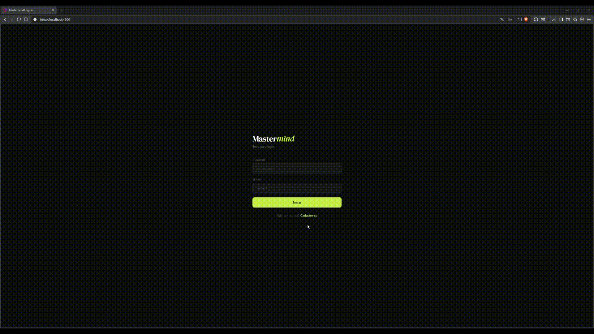

# Mastermind

Implementação web do jogo Mastermind, desenvolvida com Spring Boot no backend e Angular no frontend.

---

<p align="center">
  
</p>

---

## Tecnologias

| Camada | Tecnologia |
|--------|-----------|
| Backend | Java 23, Spring Boot, Spring Security (JWT) |
| Frontend | Angular 21, Tailwind CSS |
| Banco de dados | H2 (em memória) |
| Gerenciador | Maven (backend), npm (frontend) |

---

## Decisões técnicas

- **JWT com claims customizados** — o token carrega `id` e `username` do usuário, eliminando consultas desnecessárias ao banco para operações autenticadas.
- **H2 em memória** — banco em memória para facilitar a execução local sem dependências externas. Os dados são resetados a cada reinicialização.
- **Perfil `dev`** — a configuração de CORS é ativada via Spring Profile `dev`, mantendo o possivel ambiente de produção protegido.
- **Arquitetura em camadas** — o backend segue o padrão `Controller → Service → Repository`, com DTOs separados de entidades.
- **Signals no Angular** — facilitando gerenciamento de estado reativo.
- **Interceptor HTTP** — o token JWT é injetado automaticamente em todas as requisições via `HttpInterceptor`, sem necessidade de configuração manual por chamada.
- **Componentização** — componentes reutilizáveis extraídos das páginas: `HeaderComponent`, `FormFieldComponent`, `GameBoardRowComponent`, `GameResultComponent` e `HistoryRowComponent`.

---

## Pré-requisitos

- Java 23+
- Node.js 20+
- npm 10+
- Maven 3.9+

---

## Rodando o backend

```bash
# Na pasta /mastermind-spring
cd mastermind-spring

# Rodar com perfil dev (necessário para CORS)
./mvnw spring-boot:run -Dspring-boot.run.profiles=dev
```

O backend sobe em `http://localhost:8080`.

### Console H2

Acesse `http://localhost:8080/h2-console` com as seguintes configurações:

| Campo | Valor |
|-------|-------|
| JDBC URL | `jdbc:h2:mem:mastermind-db` |
| Username | `sa` |
| Password | *(vazio)* |

### Documentação da API

Com o backend rodando, acesse `http://localhost:8080/swagger-ui.html`.

---

## Rodando o frontend

```bash
# Na pasta /mastermind-angular
cd mastermind-angular

# Instalar dependências
npm install

# Rodar em modo de desenvolvimento
npm start
```

O frontend sobe em `http://localhost:4200`.

---

## Variáveis de ambiente

O projeto não requer variáveis de ambiente externas para rodar localmente. As configurações estão no `application.properties` do backend:

```properties
spring.profiles.active=dev
spring.h2.console.enabled=true
spring.datasource.url=jdbc:h2:mem:mastermind-db
api.security.token.secret=sua-secret-aqui
```

> ⚠️ Atualmente o projeto está com uma secret JWT hardcoded, não indicada para repositorios publicos, porem o projeto é somente para estudos.

---

## Estrutura do projeto

```
mastermind/
├── backend/
│   └── src/
│       └── main/java/.../
│           ├── controller/     # Endpoints REST
│           ├── service/        # Regras de negócio
│           ├── repository/     # Acesso ao banco
│           ├── model/          # Entidades JPA
│           ├── dto/            # Request e Response
│           ├── config/         # Security e CORS
│           └── exceptions/     # Exceções customizadas
└── frontend/
    └── src/app/
        ├── pages/              # Login, Register, Dashboard, Game, Ranking
        ├── components/         # Componentes reutilizáveis
        ├── services/           # Comunicação com a API
        ├── guards/             # Auth guard
        └── interceptors/       # JWT interceptor
```

---

## Regras do jogo

- Ao iniciar uma partida, o backend gera um código secreto de 4 letras (A, B, C ou D).
- O jogador tem até **10 tentativas** para adivinhar a combinação.
- A cada tentativa, o backend retorna apenas o **número de posições corretas** — nunca quais posições.
- A pontuação é calculada com base no número de tentativas e no tempo de duração da partida.
- O frontend nunca recebe o código secreto — apenas no caso de derrota ao final da partida.

---

## Endpoints principais

| Método | Rota | Descrição |
|--------|------|-----------|
| POST | `/auth/register` | Cadastro de usuário |
| POST | `/auth/login` | Login e geração do JWT |
| GET | `/auth/me` | Dados do usuário autenticado |
| POST | `/game` | Iniciar nova partida |
| POST | `/game/{id}/guess` | Submeter tentativa |
| GET | `/game/{id}` | Buscar partida por ID |
| GET | `/game/history` | Histórico do usuário |
| GET | `/ranking` | Ranking global |

